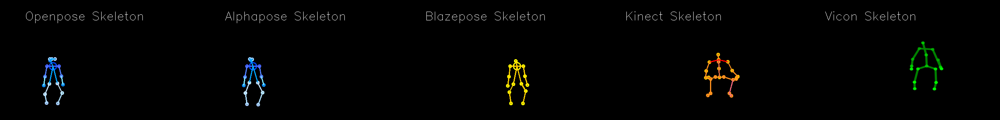

# KinesiothErapy and Rehabilitation for Assisted Ambient Living (KERAAL) Dataset

## Code for Keraal Dataset

The Keraal dataset is a medical database of clinical patients carrying out low back-pain rehabilitation exercises. It can be downloaded and more information can be read in http://nguyensmai.free.fr/KeraalDataset.html.
  The Keraal dataset is designed for human body movement analysis in the context of low-back pain physical rehabilitation. This dataset has been acquired during a clinical study where patients were performing 3 low-back pain rehabilitation exercises while being coached by a robotic system. The dataset was recorded from 9 healthy subjects and 12 patients suffering from low-back pain, and were annotated by two rehabilitation doctors. 
  It includes 3D skeleton sequences captured by a Kinect, RGB videos and 2D skeleton data estimated from videos. Moreover, medical expert annotations are associated to each patient's performance for assessment of correctness, recognition of errors, spatio-temporal localization of errors.

This repository  includes the accompanying code and the documentation for the Keraal Dataset.

## Dataset content

The dataset includes RGB video and skeleton files : from the kinect, the vicon, open-pose and blazepose. It also includes annotation files from 5 annotators.  
The files constituting the dataset are described in readme_files_description.txt.

Our dataset is composed of :

* Control command files of the robot Poppy to demonstrate the three exercises. They are json files that use the syntax commonly used by the library pypot as described in its documentation and can be used with the web-interface developed by the project Keraal to execute on Poppy. They can be used with the physical robot Poppy or its simulation.
* the therapists' annotations in a xml anvil format. They indicate  whether the execution is correct, the label of the error, the body-part causing the error and the temporal description of the beginning and ending timestamps of the error.
* anonymised RGB videos. The videos are of avi and resolution 960x544 for Group3. They are of mp4  and resolution 480x360 for groups 1a, 1b, 2a and 2b. The resolution was kept low during the coaching sessions with the robot to allow for real-time coaching. 
* the positions and orientations of each joint of the Microsoft Kinect skeleton.  The txt files display in a table, a line per timestamp. The data are presented in ASCII txt format, with space delimiter used for separating the values of positions and orientations of each joint in the order of the skeleton numbering.
* the 2D positions of each joint of the OpenPose skeleton in the COCO pose output format. The txt files give the x and y positions on each video frame in the format of a dictionary of video frame numbers and joint names.
* the positions and orientations of each joint of the Vicon skeleton.  The txt files display in a table,  a line per timestamp.

|Group | Annotation | RGB videos | Kinect  | Openpose/Blazepose  | Vicon | Nb rec |
| --- | ----------- | --- | ----------- | --- | ----------- | --- |
|1a | xml anvil : err label, bodypart, timespan |mp4, 480x360 |tabular |dictionary | NA | 249|
|1b | NA |mp4, 480x360 |tabular |dictionary | NA | 1631 |
|2a | xml anvil : err label, bodypart, timespan |mp4, 480x360 |tabular |dictionary | NA | 51|
|2b | NA |mp4, 480x360 |tabular |dictionary | NA | 151|
|3 | error label |avi, 960x544 |tabular |dictionary |tabular | 540|

## Draw Skeleton Code

The draw_skeleton folder includes  code such as a python notebook to visualise the skeleton data, and the library code.
Please download the pretrained open_pose model pose_model.pth beforehand. (available on http://nguyensmai.free.fr/data/pose_model.pth)

## Analyse Skeleton Code

The get_skeletons_from_videos folder includes python code to use open_pose on the RGB videos to extract the open_pose skeletons.
Please download the pretrained open_pose model pose_model.pth beforehand.

The evaluation_mouvements_gmm_matlab folder includes an example matlab code to use kinect skeleton data and analyse the movements using Gaussian Mixture Model (GMM) on Riemannian manifold.

The evaluation_mouvements_lstm_python folder includes an example python code to use kinect skeleton data and analyse the movements using Long Short Term Memory (LSTM).

## Annotation files

The annotate_videos folder has information for the annotation. The folder contains :

* keraalSpec.xml : defines the template of the annotations
* createAnvil.py : a python code to create template annotation files to be edited with Anvil for each video in a given folder
* LabellisationDesVideos_fr.pdf : an explanation in French of the labels used in Keraal Dataset.

## Citation

Please cite this dataset with the following citation :

@inproceedings{Nguyen2024IJCNN,
	author = {Sao Mai Nguyen and Maxime Devanne and Olivier Remy-Neris and Mathieu Lempereur and Andre Thepaut},
	booktitle = {International Joint Conference on Neural Networks},
	title = {A Medical Low-Back Pain Physical Rehabilitation Database for Human Body Movement Analysis},
	year = {2024}}
 

This dataset was collected during a prospective, controlled, single-blind, two-centre study conducted from October 2017 to May 2019 in two rehabilitation centres in Brittany (France). All participants signed informed consent forms for their participation. The study was written according to the TiDier checklist and descrined in : 

@article{Blanchard2022BRI,
	author = {Agathe Blanchard and Sao Mai Nguyen and Maxime Devanne and Mathieu Simonnet and Myriam Le Goff-Pronost and Olivier Remy-Neris},
	journal = {BioMed Research International},
	month = {mar},
	pages = {1--10},
	title = {Technical Feasibility of Supervision of Stretching Exercises by a Humanoid Robot Coach for Chronic Low Back Pain: The R-COOL Randomized Trial},
	doi={10.1155/2022/5667223},
	volume = {2022},
	year = 2022}

 

This dataset was collected during a prospective, controlled, single-blind, two-centre study conducted from October 2017 to May 2019 in two rehabilitation centres in Brittany (France). All participants signed informed consent forms for their participation. The study was written according to the TiDier checklist and descrined in : 

# Motivation and Composition
##  Motivation
### For what purpose was the dataset created? Was there a specific task in mind? Was there a specific gap that needed to be filled?

The purpose of this dataset is to provide anonymized data from physical rehabilitation patients to train  an intelligent tutoring system (ITS) capable of supervising rehabilitation sessions autonomously, by providing instructions for each exercise of the program and real-time feedback how to improve the efficiency of the patient's performance. Thus, the ITS must be capable of (1) assessing if the rehabilitation exercise is correctly performed, (2) recognising the error of the patient to give a feedback (3) localising which body part is responsible of the error (3) detecting the temporal segment where the error occurred.

Compared to existing datasets,  our Keraal dataset has been recorded within a long-term rehabilitation program, targeting low back pain, and labelled by a doctor. 
% Thus our Keraal dataset is the only benchmarking set with clinical patients and with labels provided by a physician for the four challenges : motion assessment, error recognition, spatial  and temporal localization. 

### Who created this dataset and on behalf of which entity ?

THe Keraal Dataset was created as a collaborative effort between IMT Atlantique and CHRU de Brest as part of the <a href="http://keraal.enstb.org/">Keraal experiment</a>, led by Sao Mai Nguyen and Andre Thepaut from IMT Atlantique and Olivier Remy Neris from CHRU de Brest. The overseeing of the patients' care was carrried out by Olivier Remy Neris and Mathieu Lempereur of CHRU de Brest. The data collection was carried out by Maxime Devanne at IMT Atlantique. The annotations were carried out by Olivier Remy Neris. The bechnmarking and data curation were carried out by Maxime Devanne and Sao Mai Nguyen, when at respectively UHA and U2IS.

### Who funded the creation of the dataset? If there is an associated grant, please provide the name of the grantor and the grant name and number

The research work leading to the Keraal dataset is partially supported by  the European Union’s Seventh Framework Programme for research, technological development and demonstration under grant agreement no 601116 as part of <a href="http://keraal.enstb.org"> Keraal experiment</a> of the ECHORD++ project and by 
the European Regional Development Fund (ERDF) via the VITAAL Contrat Plan Etat Region.

## Composition
### What do the instances that comprise the dataset represent (e.g., documents, photos, people, countries)? Are there multiple types of instances (e.g., movies, users, and ratings; people and interactions between them; nodes and edges)? Please provide a description.

The core element of this dataset captures a human carrying a repetition of an exercise.

Each exercise is identified and labelled, and is also represented by a Control command file of the humanoid robot Poppy to demonstrate the exercise.
    
Each repetition is recorded as a RGB video and kinect skeleton (articulated figure) sequence or a Vicon motion capture skeleton sequence.     

### What data does each instance consist of?
Each repetition of exercise can have as raw data :

* an anonymized RGB video. The videos are avi files and resolution 960x544 for Group3. They are mp4 files  and resolution 480x360 for groups 1a, 1b, 2a and 2b. The resolution was kept low during the coaching sessions with the robot to allow for real-time coaching. 
* a skeleton sequence recorded by the kinect. The txt files display in a table, a line per timestamp. The data are presented in ASCII txt format, with space delimiter used for separating the values of positions and orientations of each joint.
* a skeleton sequence recorded by the vicon.  The txt files display in a table,  a line per timestamp.
* annotations of errors and their body part and temporal localization by a doctor. They are in a xml anvil format. They indicate  whether the execution is correct, the label of the error, the body-part causing the error and the temporal description of the beginning and ending timestamps of the error.
* Control command files of the robot Poppy to demonstrate the three exercises. They are json files that use the syntax commonly used by the library pypot as described in its <a href="https://docs.poppy-project.org/en/programming/python.html"> documentation </a> and can be used with the <a href="https://github.com/GRLab/Poppy_GRR"> web-interface developed by the <a href="http://keraal.enstb.org">project Keraal</a> to execute on Poppy</a>.     They are used to execute the movement on the physical robot Poppy or its simulation.

We also added by post-processing of the RGB video:

* a 2D skeleton sequence obtained by OpenPose :  the files record the x and y positions on each video frame in the format of a dictionary of video frame numbers and joint names. OpenPose skeletons use the COCO pose output format. 
* a 3D skeleton sequence obtained by BlazePose : the files record the x, y and z positions on each video frame in the format of a dictionary of video frame numbers and joint names. BlazePose skeletons uses a topology of 33 human body keypoints, which is a superset of COCO, BlazeFace and BlazePalm topologies

### Is there a label or target associated with each instance?

Only part of the data collected are annotated:

* Patients in Group1A: 14 recordings per exercises were selected among 6 patients for annotations. Half of these recordings are taken at the beginning of the patient care with the robot, between days 1 and 3, and half of these recordings are taken during the second half of their care program, between days 7 and 12. An initial idea was to analyse if improvement was observed between the beginning and the end of the training. The remaining recordings of the 12 patients are made available without annotation as data of Group1B.</li>
* healthy subjects in Group2A : 51 recordings per exercises were selected  for annotations. The remaining recordings of the 6 healthy adults are made available without annotation as data of Group2B.

The video collected from  group1A and from group2A were annotated by a medical doctor in physiotherapy, using the <a href="http://www.anvil-software.org"> Anvil video annotation research tool</a>.
The videos are annotated at three levels. On a global evaluation level, an assessment is given as either correct or incorrect (Challenge 1). In the case of an incorrect error, he can indicate if the execution has no errors but finished before the end (label code  4 : incomplete) or the participant did not start the execution of the exercise (label code  5  : motionless). On the error classification level, in the case of an incorrect movement, annotations first indicate whether the error is significant or small as well as the label of the error (Challenge 2). Moreover the body part causing the error is also indicated (Challenge 3). He can also add a comment.
 On a temporal level, the medical doctor annotating videos can also indicate the time window where the error occurs (Challenge 4), and the same information as previously: whether the error is significant or small, the  error label, and the body part causing the error. We note that in addition to the error label identified, other label codes  4  and  5  corresponding to an incomplete and motionless sequence can be used by the medical expert annotating videos.